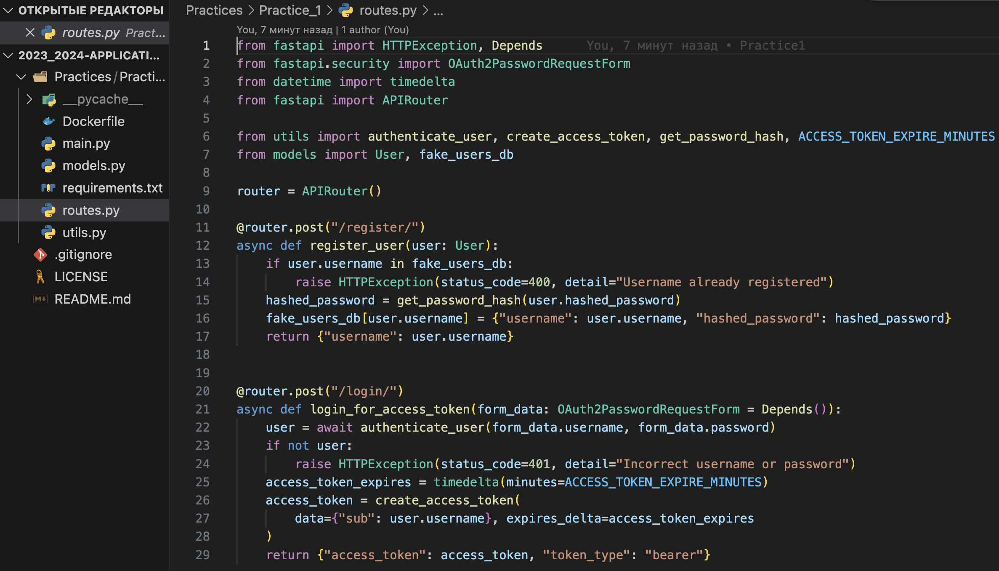
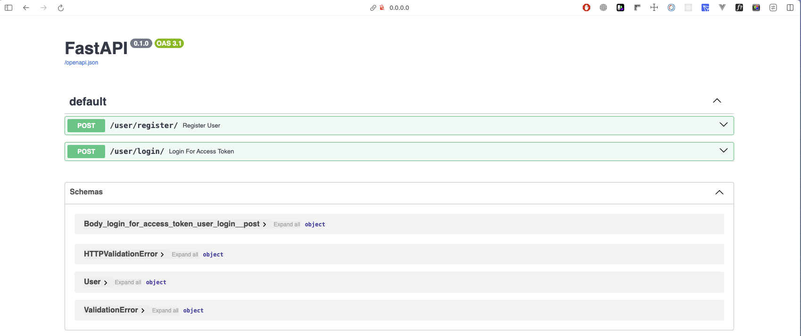
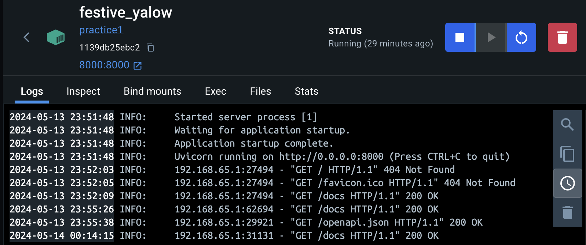

```
University: [ITMO University](https://itmo.ru/ru/)
Faculty: [FICT](https://fict.itmo.ru)
Course: [Application containerization and orchestration](https://github.com/itmo-ict-faculty/application-containerization-and-orchestration)
Year: 2023/2024
Group: K4113c
Author: Shitov Dmitry Romanovich
Practice: Practice_1
Date of create: 12.05.2024
Date of finished: 12.05.2024
```

## Описание
Это первая практическая работа "Контейнеризация микросервисных приложений"

## Цель работы
Данная работа предназначена для изучения и практического применения технологии контейнеризации при разработке микросервисных приложений.

## Ход работы

1. Создать микроcервис на языке программирования Python/Java/любом другом соответствующем следующим требованиям: Поддержка swagger Может быть контейнеризированно Выполняет 1 полезную функцию (степень полезности определяется самостоятельно) Имеет функционал хранение/записи данных в любую БД  
  

2. Определить зависимости приложения и создать Docker образ с помощью Dockerfile.
  2.1. Определение зависимостей
   ```cmd
   pip freeze > requirements.txt
   ```
   2.2. Dockerfile
   ```Dockerfile
    FROM python:3.10
    COPY requirements.txt /app/requirements.txt
    WORKDIR /app
    RUN pip install --no-cache-dir -r requirements.txt
    COPY . /app
    ENV PORT 8000
    CMD ["uvicorn", "main:app", "--host", "0.0.0.0", "--port", "8000"]
    ```  
    2.3. Создание образа 
     ```cmd
     docker build -t practice1 .
     ```   
   
3. Запустить, приложить доказательства работы приложения.  
   ```cmd
   docker run -p 8000:8000 practice1
   ```
    
     
   
