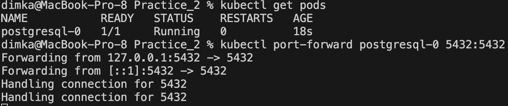

```
University: [ITMO University](https://itmo.ru/ru/)
Faculty: [FICT](https://fict.itmo.ru)
Course: [Application containerization and orchestration](https://github.com/itmo-ict-faculty/application-containerization-and-orchestration)
Year: 2023/2024
Group: K4113c
Author: Shitov Dmitry Romanovich
Practice: Practice_2
Date of create: 12.05.2024
Date of finished: 12.05.2024
```

## Описание
Это вторая практическая работа "Базы данных в микросервисных архитектурах"  

## Цель работы
Данная практическая работа направлена на изучение принципов работы с базами данных в контексте микросервисных приложений.  

## Ход работы  

1. Изучить роль баз данных в микросервисной архитектуре.  

2. Выбрать и развернуть базу данных в minikube (MongoDB/Postgres/e.t.c)  
  2.1. Выбрал PostgressQL  
  2.2. Запустил minikube  
   ```cmd
   minikube start
   ```  
    2.3. Создал манифест для StatefulSet
   ```yaml
   apiVersion: apps/v1
   kind: StatefulSet
   metadata:
     name: postgresql
   spec:
      serviceName: "postgresql"
      replicas: 1
      selector:
        matchLabels:
          app: postgresql
      template:
        metadata:
          labels:
            app: postgresql
        spec:
          containers:
          - name: postgresql
            image: postgres:latest
            env:
            - name: POSTGRES_DB
              value: database
            - name: POSTGRES_USER
              value: username
            - name: POSTGRES_PASSWORD
              value: password
            ports:
            - containerPort: 5432
              name: postgresql
            volumeMounts:
            - name: postgresql-persistent-storage
              mountPath: /var/lib/postgresql/data
      volumeClaimTemplates:
      - metadata:
          name: postgresql-persistent-storage
        spec:
          accessModes: [ "ReadWriteOnce" ]
          resources:
            requests:
              storage: 1Gi
   ```  
   2.4. Разворачиваю PostgresQL в mkinikube
   ```cmd
    kubectl apply -f postgress.yaml
   ```  
   2.5. Проверяю работу пода, пробрасываю порты и подключаюсь
   ```cmd
    kubectl get pods
   ```  
   
