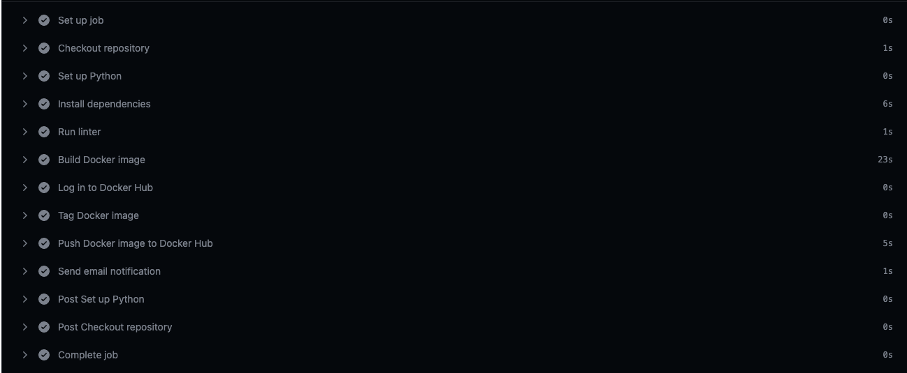
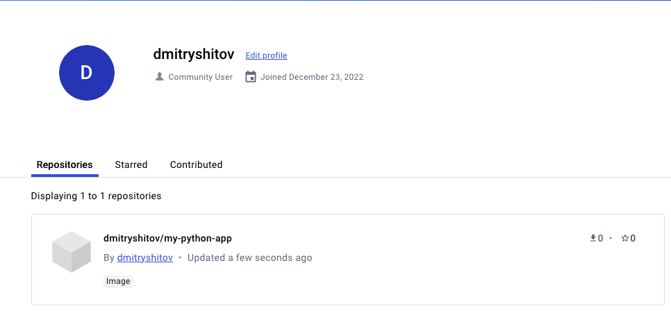

```
University: [ITMO University](https://itmo.ru/ru/)
Faculty: [FICT](https://fict.itmo.ru)
Course: [Application containerization and orchestration](https://github.com/itmo-ict-faculty/application-containerization-and-orchestration)
Year: 2023/2024
Group: K4113c
Author: Shitov Dmitry Romanovich
Practice: Practice_3
Date of create: 12.05.2024
Date of finished: 12.05.2024
```

## Описание
Это третья практическая работа "Развертывание инструментов Ci/Cd для тестового проекта"

## Цель работы
Данная практическая работа предполагает установку и настройку специальных инструментов, которые помогут автоматизировать процесс тестирования и развертывания программного обеспечения.

## Ход работы  
1. Изучить основные идеи Continuous Integration (CI) и Continuous Deployment (CD) - методы для ускорения и улучшения качества разработки.
  
2. Выбрать платформу реализующую Ci/Cd и организовать пайплайн который будет:  
  2.1. Проверять ваш код на качество оформления и синтаксические ошибки (Linter)  
  2.2. Собирать ваш код в Docker контейнер и пушить в ваш личный Docker Hub  
  2.3. Отправлять вам на почту уведомление о завершении pipeline
  
Для реализации практики была выбрана платформа GitHub Actions.  
  
Для этого написан Yaml файл с настройками  
```yaml
name: Python lint, build Docker image, and push to Docker Hub

on:
  push:
    branches:
      - main

jobs:
  build:
    runs-on: ubuntu-latest

    steps:
    - name: Checkout repository
      uses: actions/checkout@v2

    - name: Set up Python
      uses: actions/setup-python@v2
      with:
        python-version: '3.x'

    - name: Install dependencies
      run: pip install -r requirements.txt

    - name: Run linter
      run: pylint .

    - name: Build Docker image
      run: docker build -t my-python-app .

    - name: Log in to Docker Hub
      run: docker login -u "${{ secrets.DOCKER_USERNAME }}" -p "${{ secrets.DOCKER_PASSWORD }}"

    - name: Tag Docker image
      run: docker tag my-python-app "dmitryshitov/my-python-app:latest"

    - name: Push Docker image to Docker Hub
      run: docker push "dmitryshitov/my-python-app:latest"

    - name: Send email notification
      uses: dawidd6/action-send-mail@v2
      with:
        server_address: smtp.gmail.com
        server_port: 587
        username: ${{ secrets.EMAIL_USERNAME }}
        password: ${{ secrets.EMAIL_PASSWORD }}
        subject: 'GitHub Actions Pipeline Finished'
        to: 'shitovdmt@yandex.ru'
        from: 'dekaimr@gmail.com'
        body: 'Your GitHub Actions pipeline has finished successfully.'
```

После добавления секретов при пуше в main запускается pipeline и успешно проходит все стадии.  
  
  
  
